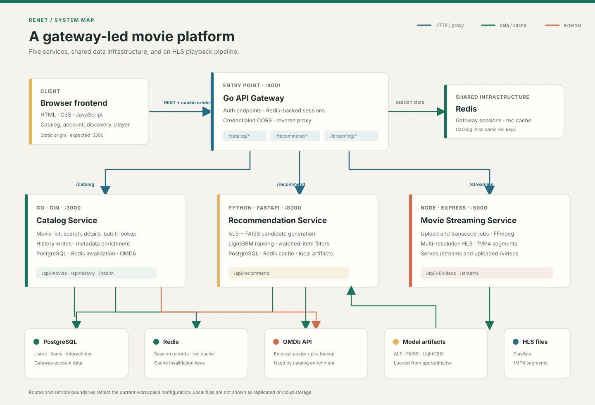

# ReNet

**A movie discovery and playback platform composed of five cooperating services.**

The workspace combines a static browser client, a Go API gateway, a Go catalog service, a FastAPI recommendation service, and an Express/TypeScript streaming service.

<p align="center">
  
</p>

## What Runs Here

| Component                                                                                      | Implementation              | Local port | Responsibility                                                                                                                                |
| ---------------------------------------------------------------------------------------------- | --------------------------- | ---------: | --------------------------------------------------------------------------------------------------------------------------------------------- |
| [Frontend](Renet_FrontEnd_Service/)                                                            | HTML, CSS, JavaScript       |   `5500`\* | Movie browsing, sign-in UI, recommendations, and playback controls. Calls the gateway on the current hostname at port `4001`.                 |
| [API Gateway](https://github.com/IamAbhinav01/RENET----API_GATEWAY/)                           | Go, Chi                     |     `4001` | Auth endpoints, Redis-backed sessions, credentialed CORS, and reverse proxies to the backend services.                                        |
| [Catalog Service](https://github.com/IamAbhinav01/RENET---Catalog_Service/)                    | Go, Gin, GORM               |     `3000` | Movie listing/search/details, history interactions, PostgreSQL access, Redis recommendation-cache invalidation, and OMDb metadata enrichment. |
| [Recommendation Service](https://github.com/IamAbhinav01/RENET---Movie-Recomendation-Backend/) | Python, FastAPI             |     `8000` | Hybrid movie recommendations using ALS, FAISS, LightGBM, PostgreSQL interactions, local model artifacts, and optional Redis caching.          |
| [Movie Streaming Service](https://github.com/IamAbhinav01/RENET-Movie_Streaming_Service/)      | TypeScript, Express, FFmpeg |     `5000` | Movie-linked video uploads, HLS transcode jobs, availability checks, and static serving of generated streams.                                 |

\* The frontend is a static site rather than a server that binds its own port. `5500` is the default frontend origin allowed by the recommendation and streaming services; serve the folder on that port for the default local CORS configuration.

## Request Flow

1. The browser calls the gateway at `http://<same-host>:4001`.
2. The gateway handles `/api/v1/auth/*` itself and proxies service-prefixed requests after stripping the prefix:

- `/catalog/*` to `127.0.0.1:3000`
- `/recommend/*` to `127.0.0.1:8000`
- `/streaming/*` to `127.0.0.1:5000`

3. The catalog and recommendation services use PostgreSQL for movie and interaction data. Catalog history writes invalidate matching recommendation cache keys in Redis.
4. Uploads can include a catalog `movieId`. The streaming service stores the job-to-movie mapping locally, and the frontend checks mapped IDs before showing Play. Playback requests the mapped movie stream, not an arbitrary upload.
5. The streaming service uses FFmpeg to create multi-resolution HLS playlists and fragmented MP4 segments, then serves them from its `/streams` route.

The gateway uses a Redis-backed `session_id` cookie. It protects catalog history, personalized recommendations, and most streaming routes. It forwards the authenticated user ID to catalog history and recommendation requests; the personalized recommendation API does not accept a caller-selected user ID. Health checks, video-availability lookup, HLS/static stream paths, and the legacy random-video route have explicit gateway exceptions.

## Data & Integrations

- **PostgreSQL:** shared movie and interaction data (`users`, `items`, and `interactions` are used by the recommendation service; the gateway also uses PostgreSQL for its own user data).
- **Redis:** gateway sessions, recommendation response caching, and catalog-triggered recommendation-cache invalidation. The recommendation and catalog services can continue without Redis in their current code; the gateway requires Redis for sessions.
- **OMDb:** catalog metadata enrichment for posters and plots. The catalog service requires an `OMDB_API_KEY` to start.
- **Recommendation artifacts:** model/index files are loaded from `ReNet_Recommendation/app/artifacts/` during recommender startup.
- **Streaming files:** source uploads and generated HLS output live under the streaming service's `src/public/` tree; these files are local to that service unless separately persisted or shared.
- **Video mappings:** job state and movie-to-job associations are persisted in `RENET-Movie_Streaming_Service/src/data/video-jobs.json`, outside the static `/streams` directory. This is local filesystem persistence, not shared storage for multiple service instances.

## Local Development

### Prerequisites

- Go toolchain for the gateway and catalog service
- Python and the packages in `ReNet_Recommendation/requirements.txt`
- Node.js and npm for the streaming service
- PostgreSQL and Redis
- An OMDb API key for catalog startup
- The recommendation model/index artifacts in `ReNet_Recommendation/app/artifacts/`

Each service reads its own `.env`. Keep credentials in those local files or environment variables; do not copy secret values into documentation or commit them. The checked-in workspace configuration currently uses gateway `4001`, catalog `3000`, recommender `8000`, and streaming `5000`.

### Start Services

Start PostgreSQL and Redis first. Then run each service in its own terminal, from its project directory.

**Catalog**

```powershell
cd Renet_CataLog_Service
go run .
```

The catalog requires `PORT`, `DB_URL`, and `OMDB_API_KEY`; `REDIS_ADDR` is optional for the service's cache invalidation integration.

**Recommendation API**

```powershell
cd ReNet_Recommendation
py -m venv .venv
.\.venv\Scripts\Activate.ps1
pip install -r requirements.txt
py -m uvicorn main:app --host 127.0.0.1 --port 8000
```

Configure `DB_URL` and `PORT` in this service's `.env`. Redis settings are read through `HOST` and `REDIS_PORT`. The service loads its model artifacts and database-backed data during startup.

**Streaming service**

```powershell
cd RENET-Movie_Streaming_Service
npm install
npm run dev
```

Its local `.env` must keep `PORT=5000` to match the gateway's configured upstream. The service code alone falls back to port `3000` if `PORT` is absent.

**API Gateway**

```powershell
cd RENET----API_GATEWAY
go run .
```

The gateway requires its PostgreSQL connection settings, `PORT=4001`, and a reachable Redis instance for sessions.

**Frontend**

Serve `Renet_FrontEnd_Service/` over HTTP on port `5500` (for example, with VS Code Live Server or `py -m http.server 5500` from that directory), then open `http://localhost:5500`. Do not open `index.html` as a `file://` URL: browser session cookies and the configured CORS origins expect an HTTP origin. If using a different host or port, update the `FRONTEND_ORIGINS` settings used by the recommender and streaming service.

### Database Seeding Warning

`ReNet_Recommendation/seed_db.py` creates the SQLAlchemy tables, then deletes existing rows from `interactions`, `items`, and `users` before loading the bundled MovieLens data. Run it only against a fresh or disposable development database after checking the target `DB_URL`; it is not a non-destructive migration.

## Main Routes

| Gateway path                                              | Purpose                                                                                       |
| --------------------------------------------------------- | --------------------------------------------------------------------------------------------- |
| `/api/v1/auth/signup`, `/login`, `/me`, `/logout`         | Create account, establish/check session, and sign out.                                        |
| `/catalog/api/movies?page=1&limit=20`                     | Paginated movie catalog.                                                                      |
| `/catalog/api/movies/search?q=...`                        | Search catalog titles.                                                                        |
| `/catalog/api/movies/:id` and `/catalog/api/movies/batch` | Movie lookup and batch lookup.                                                                |
| `/catalog/api/history`                                    | Authenticated watch/rating history.                                                           |
| `/recommend/api/recommend?movie_name=...&n=8`             | Public title-based recommendations; does not return a user's personalized feed.               |
| `/recommend/api/user/recommend?n=8`                       | Session-authenticated personalized recommendations; the gateway forwards the session user ID. |
| `POST /streaming/api/v1/videos/availability`              | Return the movie IDs that currently have a non-failed video job.                              |
| `GET /streaming/api/v1/videos/movie/:movieId`             | Return the mapped HLS stream, or `202` while its first playable playlist is being prepared.   |
| `POST /streaming/api/v1/videos/upload`                    | Upload a video; include multipart `movieId` to associate it with a catalog title.             |
| `/streaming/api/v1/videos/status/:jobId`                  | Check an upload transcode job.                                                                |
| `/streaming/streams/...`                                  | HLS master/variant playlists and segments.                                                    |

## Current Behavior & Boundaries

- The frontend shows Play only for movies returned by the streaming availability endpoint, and requests `/videos/movie/:movieId` for playback. Existing uploads without a `movieId` remain unlinked; associate them by uploading with the movie ID.
- Movie-to-job associations are persisted locally. They are not synchronized between multiple streaming-service instances, so a multi-instance deployment needs shared durable storage or a database-backed mapping.
- Personalized recommendations require a gateway session. The public title-based endpoint accepts `movie_name`; a `user_id` query parameter is not used to select a user's private recommendations.
- HLS paths and the legacy random-video route are explicitly reachable without gateway session middleware. Keep backend ports appropriately network-restricted outside local development.
- Gateway backends currently target IPv4 loopback addresses. Running services in separate containers requires changing those targets to reachable service hostnames.

## Workspace Layout

```text
ReNet/
├── README.md
├── architecture.svg
├── Renet_FrontEnd_Service/       # Static browser application
├── RENET----API_GATEWAY/        # Go auth, sessions, and reverse proxy
├── Renet_CataLog_Service/       # Go catalog and interaction API
├── ReNet_Recommendation/        # FastAPI recommender and ML artifacts
└── RENET-Movie_Streaming_Service/ # Express API and FFmpeg/HLS processing
```
